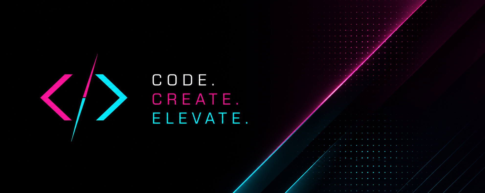

<div align="center">



# ⚡ Laser Frame Studio

### Creative Motion Design • 2D Animation • Digital Storytelling

<p align="center">
  
  
  
</p>

</div>

---

## 🚀 About

Laser Frame Studio is a creative motion design and animation collective focused on crafting visually compelling digital experiences through motion graphics, cinematic storytelling, and immersive visual design.

We collaborate with brands, startups, agencies, and creators to transform ideas into engaging visual narratives that connect with audiences and leave lasting impressions.

Combining artistic direction with modern technology, our work blends creativity, precision, and innovation across animation, branding, and digital media.

---

## ✨ Core Services

- 🎬 2D Animation
- ⚡ Motion Graphics
- 🎨 Brand Storytelling
- 🌐 Immersive Digital Experiences
- 📱 Social Media Visuals
- 🎥 Promotional Content
- 🧠 Creative Direction
- 💡 Visual Identity Design

---

## 🛠 Creative Process

```text
Concept → Storyboard → Design → Animation → Sound → Final Experience
````

---

## 🌟 Vision

To push the boundaries of motion design and digital storytelling by creating immersive visual experiences that inspire, engage, and elevate brands.

---

## 🤝 Collaborations

We work with:

* Creative Agencies
* Startups
* Brands & Businesses
* Artists & Creators
* Media Production Teams
* Digital Platforms

---

## 📸 Portfolio

Selected works and visual experiments coming soon.

---

## 🌐 Connect

* Website — Coming Soon
* Instagram — Coming Soon
* Behance — Coming Soon
* LinkedIn — Coming Soon

---

<div align="center">

### ⚡ Laser Frame Studio

Designing Motion. Crafting Stories. Creating Experiences.

</div>
